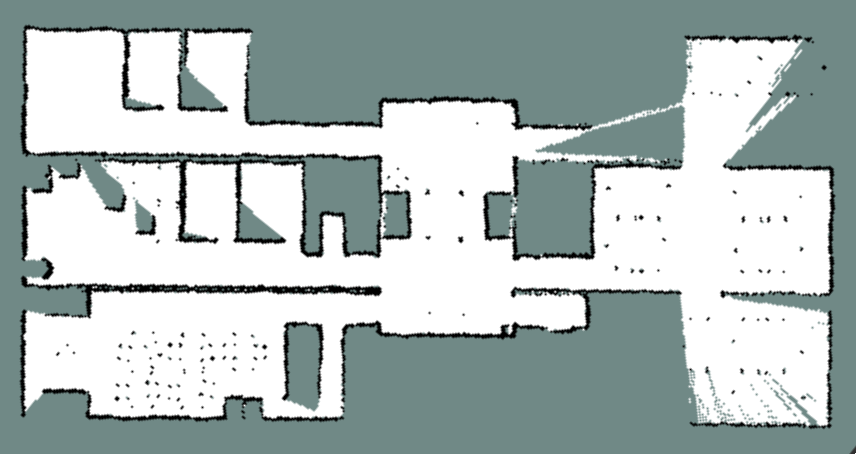
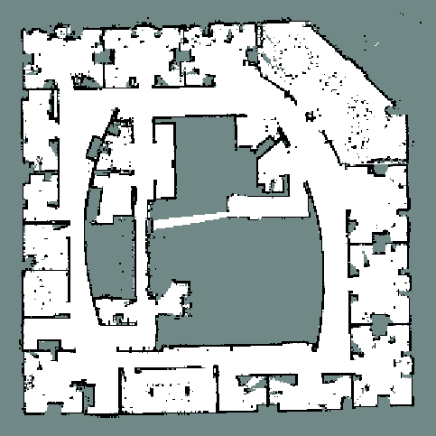
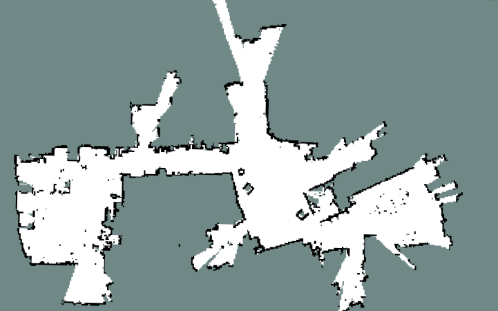
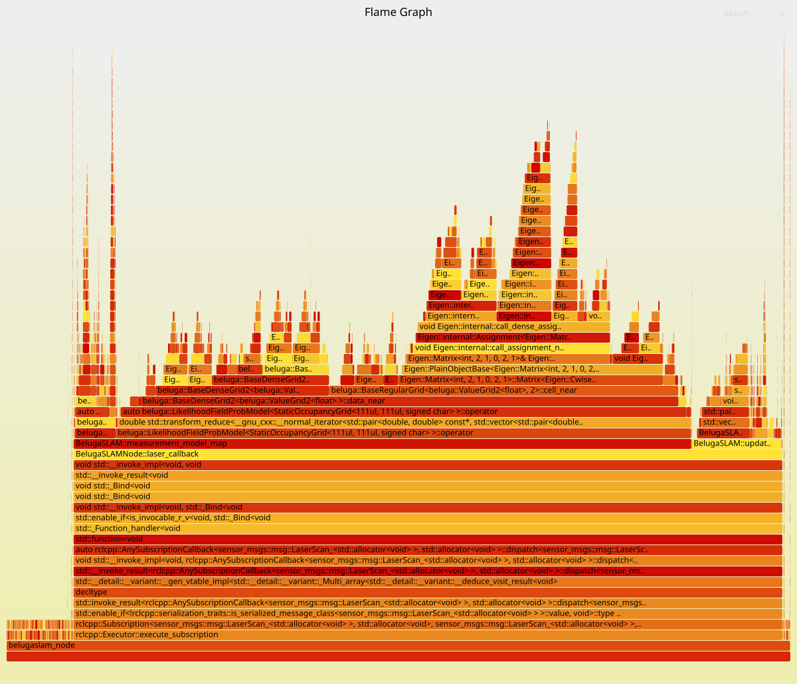

# Beluga-MH
An open-source **multi-hypothesis 2D LiDAR SLAM system** built on **ROS 2** that preserves uncertainty across both local trajectory modes and competing loop-closure interpretations beyond the single MAP (Maximum A Posteriori) trajectory.

---

## Overview

In 2D LiDAR SLAM, ambiguous observations (e.g., in repetitive corridors, symmetric rooms, or open halls) often produce multiple plausible trajectories and competing loop-closure associations. Standard RBPF-SLAM and pose-graph methods prematurely collapse the belief to the single most probable (MAP) estimate, permanently discarding secondary alternatives that might later turn out to be correct.

**Beluga-MH** addresses this problem by maintaining a **hierarchical belief representation** that preserves alternatives at two levels:

1. **Frontend (Trajectory Modes):** Persistent clusters in the conditional particle population give rise to separate trajectory hypotheses, allowing initially low-mass modes to survive and dominate if subsequent LiDAR observations support them.
2. **Backend (Delayed Loop Decisions):** Ambiguous loop closures generate competing **loop** and **no-loop** graph hypotheses. Rather than committing immediately, Beluga-MH delays decisions, gathering subsequent LiDAR scan evidence over frozen validation maps until sequential Bayesian thresholds accept or reject the candidate.
3. **Memory & Real-Time Bounds:** Shared immutable submaps and **copy-on-write active maps** prevent memory explosion, enabling deterministic bounds suitable for online execution on robotic hardware.

---

## Key Features

| Component | Description |
|---|---|
| **Sensor Input** | 2D LiDAR scans (`sensor_msgs/LaserScan`) and odometry (`nav_msgs/Odometry`) |
| **Hierarchical Belief** | Hypotheses maintain their own pose graph, active submaps, and conditional particles |
| **Motion Model** | Differential drive with noise parameters |
| **Scan Matching** | Distance-Field Scan Matching + Ceres probability field tracking |
| **Particle Proposal** | Scan-informed proposals combining frontend matcher alignment with odometric priors |
| **Submaps** | Cartographer-style overlapping submaps (50% overlap, 60 keyframes per finished submap) |
| **Place Recognition** | 2D Scan Context++ descriptor (ring key + sector key + circular yaw seed) |
| **Loop Verification** | SE(2) trial PGO trajectory deformation compatibility gate |
| **Delayed Decisions** | Sequential Bayesian evidence testing on frozen validation submaps |
| **Backend Optimization** | Ceres Solver pose-graph optimization with exact analytic SE(2) Jacobians and Huber robust loss |
| **Resampling** | Conditional ESS-triggered resampling with largest-remainder allocation of particle budget |
| **Memory Efficiency** | Shared immutable submaps + copy-on-write (COW) active grid detachment |

---

## Architecture

```
beluga2.5/
├── belugaslam_core/        # Core SLAM algorithms (ROS-independent C++17 library)
│   ├── include/
│   │   ├── belugaslam_core/ # Multi-hypothesis tracking, submaps, Scan Context 2D, PGO, Bayes evidence
│   │   └── beluga/          # Vendored Beluga 2.0 primitives (MCL, motion & sensor models)
│   ├── src/
│   └── config/
│       └── grid_config.py   # Predefined environment geometry presets (generates grid_config.hpp)
│
├── belugaslam_node/         # ROS 2 node wrapper
│   ├── src/
│   │   ├── belugaslam_node.cpp            # Node entrypoint
│   │   └── fastslam_oc_grid_node.cpp      # Parameter registration, ROS 2 pub/sub, TF broadcast
│   └── launch/
│       └── fastslam_oc_grid.launch.py     # Launch file with 70+ configurable parameters
│
├── belugaslam_example/      # Dataset replays, example XML launch files, and RViz configs
│   ├── example/launch/      # Presets for Intel and MIT datasets (with/without pure frontend)
│   ├── bags/                # Datasets (Intel, MIT, and HQ simulation)
│   └── RVIZFiles/           # RViz visualization configuration
│
├── belugaslam_benchmark/    # Benchmarking and profiling toolsuite
│   ├── benchmarking/        # Automated sweeps, EVO RMSE scripts, map comparison
│   └── profiling/           # CPU flamegraph profiling via perf
│
└── docs/images/             # Maps, EVO trajectory plots, flamegraphs
```

### ROS 2 Interface

| Direction | Topic | Type | Description |
|---|---|---|---|
| **Subscribe** | `/scan` | `sensor_msgs/LaserScan` | 2D LiDAR range measurements |
| **Subscribe** | `/odom` | `nav_msgs/Odometry` | Wheel or visual odometry increments |
| **Publish** | `/map` | `nav_msgs/OccupancyGrid` | Map from the selected consistent hypothesis |
| **Publish** | `/particle_cloud` | `geometry_msgs/PoseArray` | Multi-hypothesis particle population |
| **Publish** | `/estimated_pose` | `geometry_msgs/PoseStamped` | Current estimated robot pose |
| **Publish** | `/loop_closure_markers`| `visualization_msgs/MarkerArray` | Active and trial loop constraints |
| **TF** | `map` → `odom` | `tf2_ros` | Broadcasts map-to-odom transform |

---

## Dependencies

### Core Build Dependencies

- **ROS 2** (rclcpp, nav_msgs, sensor_msgs, tf2_ros, visualization_msgs)
- **C++17** compiler
- **Eigen3** (linear algebra)
- **Sophus** (SE(2) Lie groups)
- **Ceres Solver** (scan matching and pose-graph optimization)
- **Intel TBB** (parallel particle processing and loop candidate evaluations)
- **CMake ≥ 3.16** and **Python 3**

### Optional (Evaluation & Profiling)

- [**EVO**](https://github.com/MichaelGrupp/evo) (trajectory error analysis: APE, RPE)
<!-- - **perf** + [**FlameGraph**](https://github.com/brendangregg/FlameGraph) (CPU profiling) TODO: agregar profiling -->

---

## Usage Instructions

For detailed usage instructions and examples, please refer to the [Example README](belugaslam_example/README.md).

---
## Results

Some representative results of the FastSLAM implementation are shown in this [README](RESULTS.md), including occupancy grid maps generated from different datasets.


<!-- ## Build 

```bash
# 1. Source your ROS 2 installation
source /opt/ros/${ROS_DISTRO}/setup.bash

# 2. Select environment preset in belugaslam_core/config/grid_config.py:
#    ENV = 1  →  MIT Stata Center
#    ENV = 2  →  Intel Research Lab
#    ENV = 3  →  Beluga HQ (profiling)
#    ENV = 4  →  Beluga HQ Simulation

# 3. Build workspace
cd ~/ros2_ws
colcon build --packages-select belugaslam_core belugaslam_node belugaslam_example belugaslam_benchmark
source install/setup.bash
```

> **Note:** `grid_config.py` runs during CMake build to produce `grid_config.hpp`. Changing `ENV` requires rebuilding `belugaslam_core`.

---

## Usage

### Quick Start — Intel Research Lab Dataset

```bash
cd ~/ros2_ws
source /opt/ros/${ROS_DISTRO}/setup.bash
source install/setup.bash

# Ensure dataset converter script is executable
chmod +x src/beluga2.5/belugaslam_example/bags/intel/intel_clf_to_ros2.py

# Launch Beluga-MH, RViz, and synchronized bag replay
ros2 launch belugaslam_example intel_dataset_belugaslam.xml record_bag:=true
```

*(Ensure `ENV = 2` is set in `grid_config.py`).*

### Manual Launch (Three Terminals)

**Terminal 1 — RViz:**
```bash
cd ~/ros2_ws
source install/setup.bash
rviz2 -d src/beluga2.5/belugaslam_example/RVIZFiles/config.rviz
```

**Terminal 2 — Beluga-MH Node:**
```bash
cd ~/ros2_ws
source install/setup.bash
ros2 launch belugaslam_node fastslam_oc_grid.launch.py \
  min_particles:=5 \
  max_particles:=30 \
  base_frame:=base_footprint \
  odom_frame:=odom_combined \
  scan_topic:=/base_scan \
  range_max:=30.0
```

**Terminal 3 — Replay Rosbag:**
```bash
ros2 bag play <path_to_rosbag> --clock
```

---

## Configuration & Parameters

### Predefined Environments (`grid_config.py`)

| ENV | Dataset | Grid Dimensions | Resolution | Origin Offset |
|---|---|---|---|---|
| **1** | MIT Stata Center | 250 × 400 | 0.10 m | Centered offset |
| **2** | Intel Research Lab | 350 × 350 | 0.10 m | Centered offset |
| **3** | Beluga HQ (Profiling) | 111 × 111 | 0.05 m | Centered offset |
| **4** | HQ Simulation | 500 × 500 | 0.075 m | Centered offset |

*Submaps are decoupled from the global grid and sized to 12 m × 12 m.*

### Key Launch Parameters

<details>
<summary><b>Multi-Hypothesis & Particle Budget</b></summary>

| Parameter | Default | Description |
|---|---|---|
| `max_hypotheses` | 4 | Maximum concurrent graph hypotheses ($H_{\max}$) |
| `min_particles` | 10 | Minimum particle population bound |
| `max_particles` | 50 | Total particle budget across hypotheses ($N_{\max}$) |
| `split_min_mass` | 0.02 | Minimum mass required to fork a new spatial mode |
| `split_min_particles` | 2 | Minimum particles required to form a spatial cluster |
| `split_persistence` | 3 | Scans a spatial mode must persist before branching |
| `hypothesis_prune_mass` | 1e-06 | Prune hypotheses falling below this posterior mass |
| `random_seed` | 42 | Seed for reproducible execution (0 = random) |

</details>

<details>
<summary><b>Frontend Tracking & Proposals</b></summary>

| Parameter | Default | Description |
|---|---|---|
| `tracking_matcher` | `probability_ceres` | Frontend matcher (`distance` or `probability_ceres`) |
| `tracking_prior_mode` | `odometry` | Matcher motion prior (`odometry` or `fixed`) |
| `scan_informed_proposal` | true | Enable scan-informed particle proposal distribution |
| `motion_proposal_samples` | 8 | Number of proposal candidates ($K$) evaluated per particle |
| `deskew_scan` | true | Compensate within-scan robot motion |
| `tracking_effective_beams` | 20.0 | Effective LiDAR beams used for measurement evidence |
| `alpha1` – `alpha4` | 0.1, 0.05, 0.1, 0.05 | Differential drive odometry noise coefficients |

</details>

<details>
<summary><b>Submaps & Keyframes</b></summary>

| Parameter | Default | Description |
|---|---|---|
| `submap_num_range_data` | 30 | Keyframes before starting next overlapping submap |
| `keyframe_min_translation` | 0.15 m | Minimum displacement for keyframe insertion |
| `keyframe_min_rotation` | 0.087 rad | Minimum rotation for keyframe insertion |
| `keyframe_max_time` | 5.0 s | Max time between keyframes |
| `map_resolution` | 0.05 m | Published occupancy grid resolution |

</details>

<details>
<summary><b>Multi-Hypothesis Loop Closure & Verification</b></summary>

| Parameter | Default | Description |
|---|---|---|
| `enable_loop_closure` | true | Enable multi-hypothesis loop search and branching |
| `loop_use_scan_context_2d` | true | Enable 2D Scan Context++ place recognition |
| `loop_candidate_distance` | 10.0 m | Maximum pose prior search distance |
| `loop_min_score` | 0.55 | Minimum registration score for candidates |
| `loop_min_overlap` | 0.35 | Minimum scan overlap fraction with submap |
| `loop_update_mode` | `bayes` | `bayes` (sequential evidence) or `heuristic` (ablation) |
| `loop_verifier_mode` | `belief` | Verifier mode (`belief` required for `bayes`; `map`, `uniform`, `geometry` for heuristic ablation) |
| `loop_bayes_accept_probability` | 0.95 | Threshold $\tau_A$ to commit to the loop branch |
| `loop_bayes_reject_probability` | 0.05 | Threshold $\tau_R$ to discard the loop branch |
| `loop_bayes_min_scans` | 10 | Minimum future scans before deciding |
| `loop_undecided_max_scans` | 20 | Window before forcing decision on ambiguous events |

</details>

<details>
<summary><b>Pose Graph Optimization (PGO)</b></summary>

| Parameter | Default | Description |
|---|---|---|
| `enable_pgo` | true | Enable backend pose graph optimization |
| `pgo_every_n_nodes` | 20 | Trigger PGO every N inserted keyframes |
| `pgo_max_iterations` | 50 | Maximum Ceres iterations per solve |
| `pgo_analytic_jacobians` | true | Use exact analytic SE(2) Jacobians (faster than AutoDiff) |
| `pgo_huber_scale` | 1.0 | Robust loss Huber scale |
| `pgo_loop_translation_weight` | 10.0 | Information weight on loop translation constraints |
| `pgo_loop_rotation_weight` | 12.0 | Information weight on loop rotation constraints |

</details>

<details>
<summary><b>Diagnostics & Output Selection</b></summary>

| Parameter | Default | Description |
|---|---|---|
| `output_selection_mode` | `map` | `map` (highest mass) or `pose_risk` (minimum risk) |
| `final_trajectory_path` | `""` | Optional CSV export of final online + PGO trajectory |
| `detection_events_path` | `""` | Optional CSV export of hypothesis forking and loop events |
| `optimized_trajectory_path` | `""` | Write PGO trajectory in TUM format on clean shutdown |

</details>

---

## Experimental Results

Beluga-MH was evaluated against **SLAM Toolbox** (the default Nav2 SLAM system) and **Beluga-MAP** (an ablation of Beluga-MH that immediately collapses to the highest-mass hypothesis at every bifurcation).

### Trajectory Accuracy: APE RMSE (m)

*Values averaged across multiple independent runs:*

| System | Intel Research Lab | HQ Simulation | MIT Stata Center |
|---|:---:|:---:|:---:|
| **Beluga-MH** | **0.076** | **0.020** | **0.085** |
| Beluga-MAP (Ablation) | 0.082 | 0.022 | 0.088 |
| SLAM Toolbox | 0.266 | 0.023 | 0.086 |

*Beluga-MH achieves the lowest average APE RMSE across all datasets, with the most pronounced advantage on the longest and most ambiguous sequence (Intel Research Lab), where delaying loop commitments and maintaining alternative trajectory modes prevents catastrophic filter collapse.*

<table align="center">
  <tr>
    <td align="center">
      
      <br><sub>HQ Simulation</sub>
    </td>
    <td align="center">
      
      <br><sub>Intel Research Lab</sub>
    </td>
    <td align="center">
      
      <br><sub>MIT Stata Center</sub>
    </td>
  </tr>
</table>

For additional trajectory plots and detailed metric breakdowns, see [RESULTS.md](RESULTS.md).

---

## Benchmarking & Profiling

### Automated Benchmarks

Execute multi-particle parameter sweeps:
```bash
ros2 run belugaslam_benchmark parameterized_run.sh <PARTICLES_MIN> <PARTICLES_MAX>
```

Compare execution time and trajectory statistics across runs:
```bash
ros2 run belugaslam_benchmark compare_results.py <PATH_TO_OUTPUT_DIR>
```

### CPU Flamegraph Profiling

Generate interactive SVG flamegraphs using Linux `perf`:
```bash
ros2 run belugaslam_benchmark profile_belugaslam_with_bagfile
ros2 run belugaslam_benchmark flamegraph
```

<p align="center">
  
  <br>
  <sub>Flamegraph showing CPU execution breakdown of Beluga-MH.</sub>
</p>
-->
---

## Acknowledgments & Bibliography

- **Beluga:** Inspired by and builds upon the [Beluga](https://github.com/ekumenlabs/beluga) library for modern Monte Carlo Localization in ROS 2.
- **Theoretical Foundations:** Based on probabilistic robotics concepts originally introduced in *Probabilistic Robotics* (Thrun, Burgard, Fox) and extended with multi-hypothesis belief modeling and delayed Bayesian decision-making.

---

## License

This project is licensed under the [Apache License 2.0](LICENSE).  
