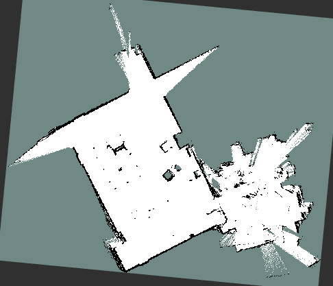
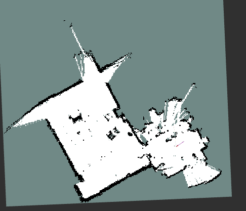
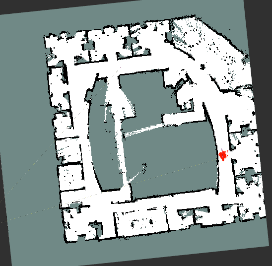
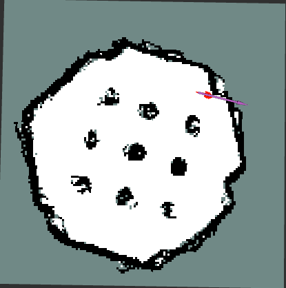

# Results

## Comparison with SLAM Toolbox

### MIT Stata Center
<table align="center">
  <tr>
    <td align="center">
      
       
      <b>SLAM Toolbox with loop closure</b>
    </td>
    <td align="center">
      
       
      <b>Beluga 2.5 with 500 particles</b>
    </td>
  </tr>
</table>

## Other results from this FastSLAM node

<table align="center">
  <tr>
    <td align="center">
      
       
      <b>Intel Lab</b> (500 particles, 10 cm cell size)
    </td>
    <td align="center">
      
       
      <b>Beluga ROS bag</b> (800 particles, 5 cm cell size)
    </td>
  </tr>
</table>