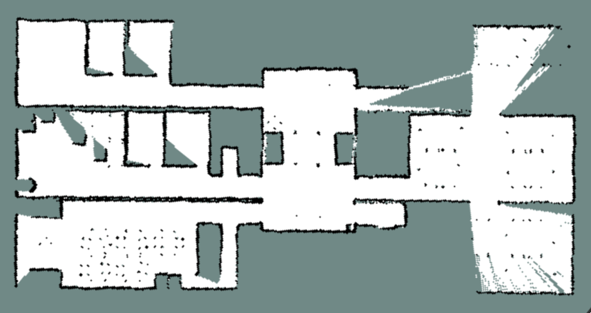
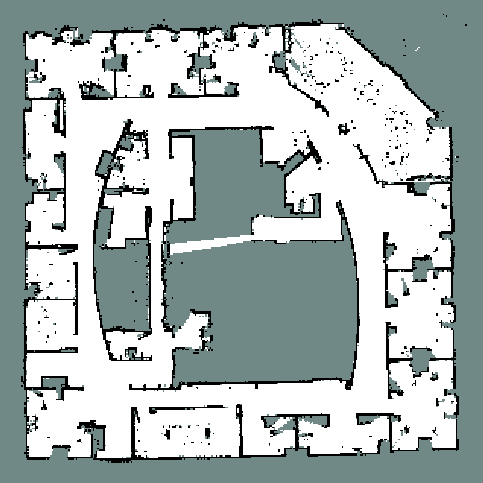
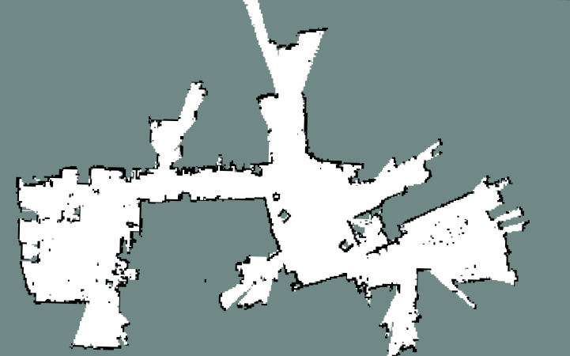
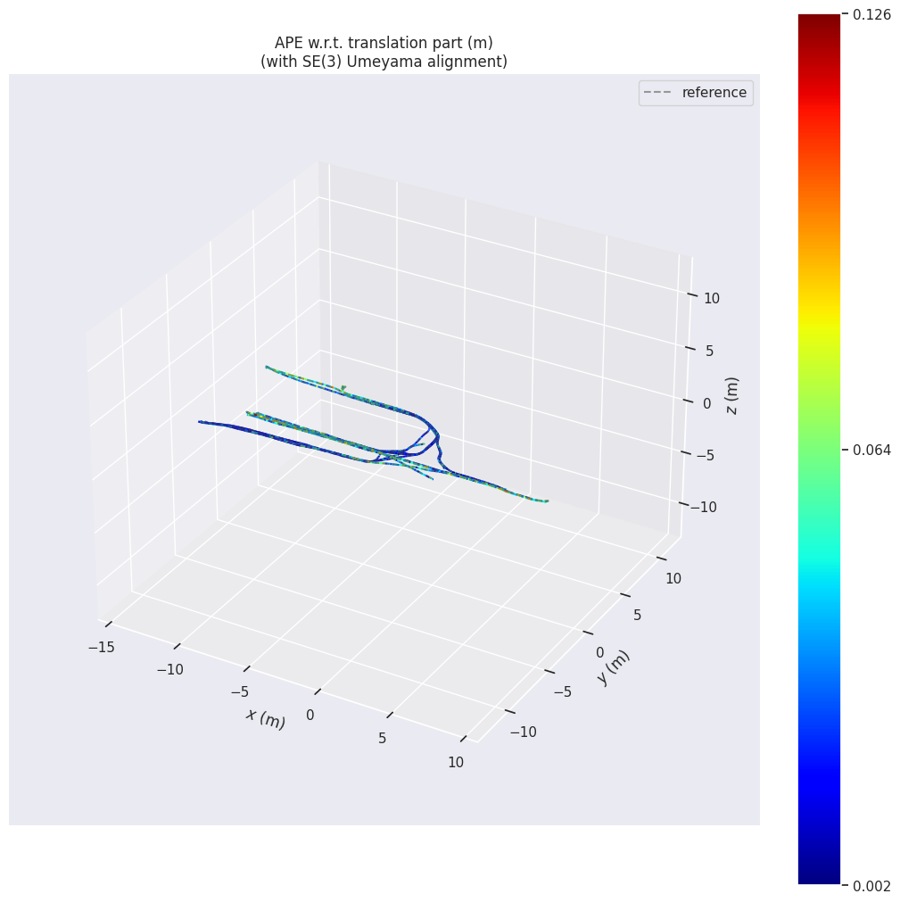
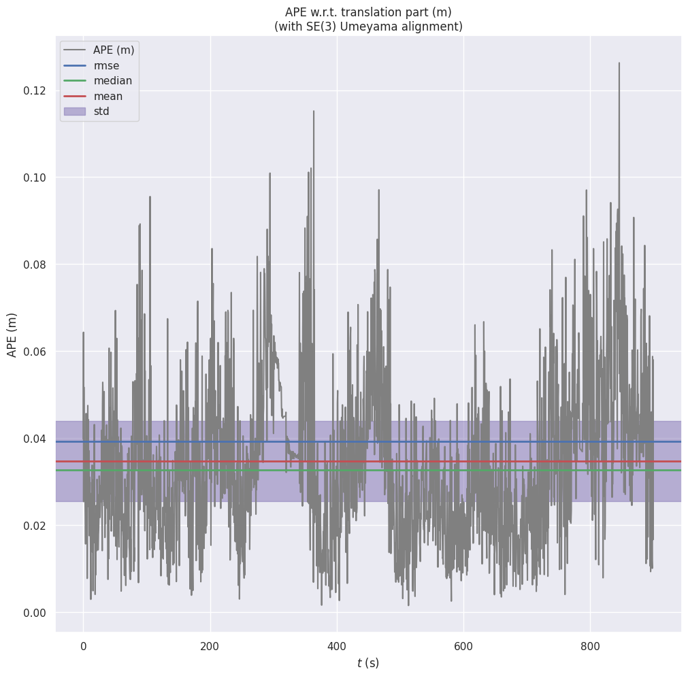
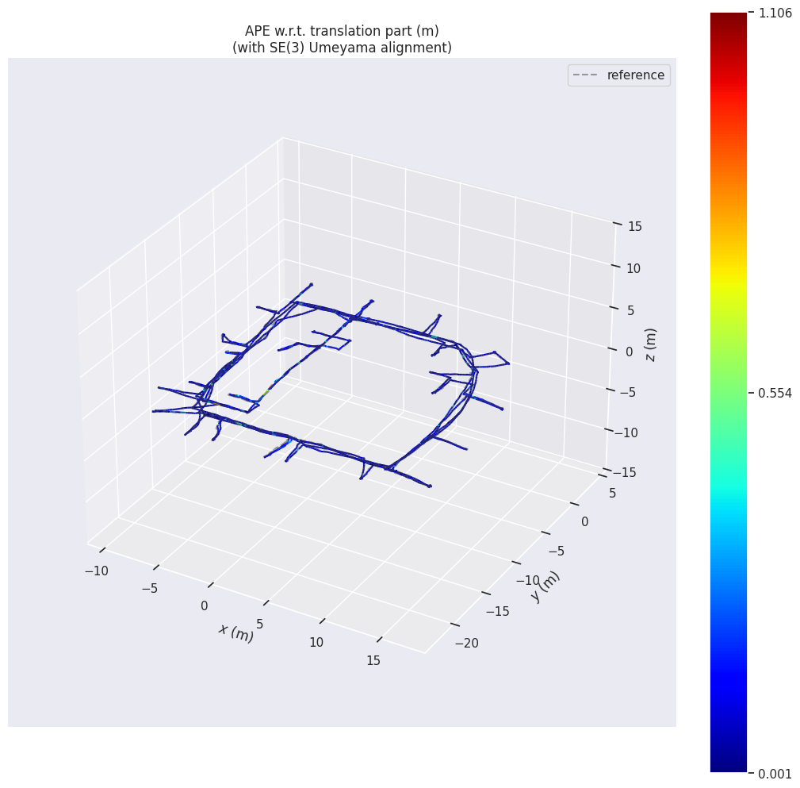
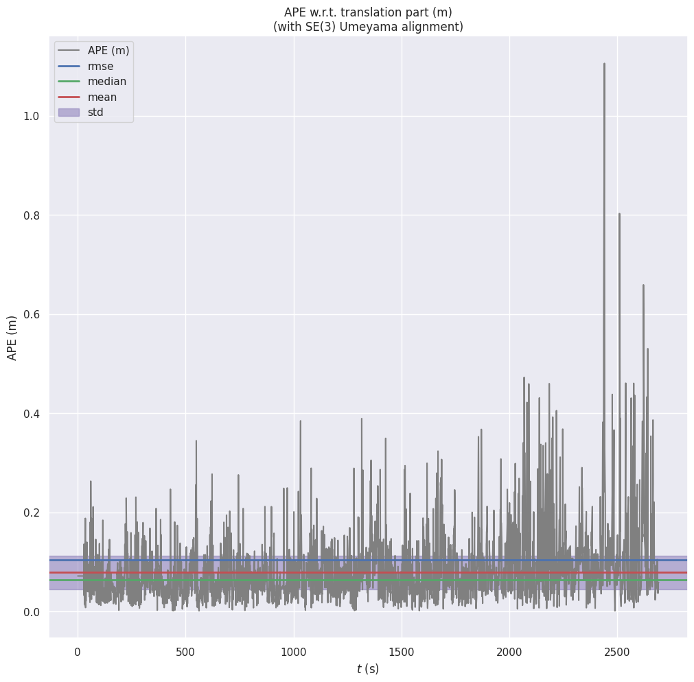
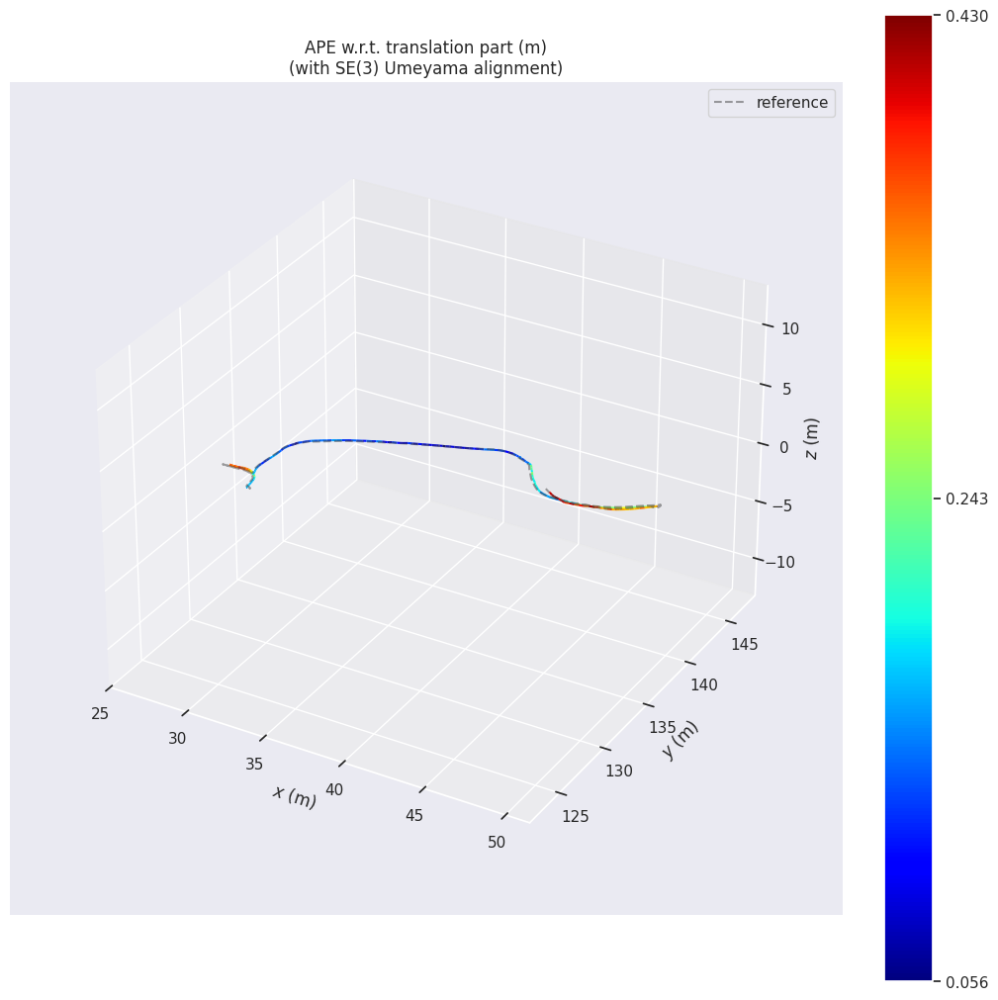
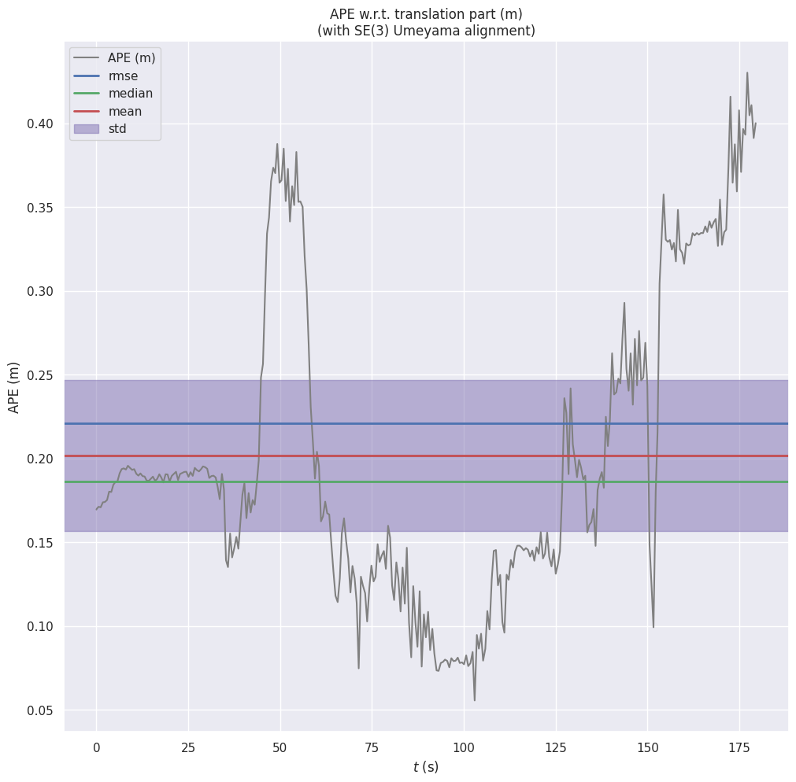

# Results

## Maps Generated by BelugaSLAM on Different Datasets

All experiments were conducted using KLD-adaptive sampling with a minimum of 5 particles and a maximum of 30 particles.

  
   
  <b>HQ Simulation Dataset (segment 00).</b>

 

  
   
  <b>Intel Research Lab Dataset.</b>

 

  
   
  <b>MIT Stata Center Dataset (2012-04-06-11-15-29).</b>

--- 
## Trajectory Evaluation on different ROSBags 

<table align="center">
  <tr>
    <td align="center">
      
    </td>
    <td align="center">
      
    </td>
  </tr>
</table>

  <b></b> Evaluation on the HQ Simulation Dataset. The estimated trajectory is compared against the ground truth, yielding an Absolute Pose Error (APE) RMSE of <b>0.0393 m</b>.

<table align="center">
  <tr>
    <td align="center">
      
    </td>
    <td align="center">
      
    </td>
  </tr>
</table>

  <b></b> Evaluation on the Intel Research Lab dataset. Absolute Pose Error (APE) RMSE of <b>0.1038 m</b>.

<table align="center">
  <tr>
    <td align="center">
      
    </td>
    <td align="center">
      
    </td>
  </tr>
</table>

  <b></b> Evaluation on the MIT Stata Center Dataset. Absolute Pose Error (APE) RMSE of <b>0.2211 m</b>.

---
## Evaluation Tools

Trajectory evaluation was performed using EVO, a Python package for the evaluation of odometry and SLAM algorithms.

Repository: https://github.com/MichaelGrupp/evo

